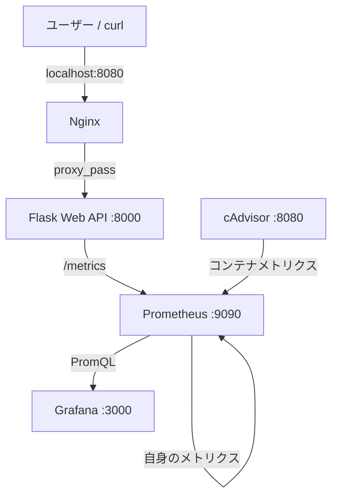

# Docker + Prometheus + Grafana Web Service Monitoring

Docker Composeで起動できる、Flask製Web APIの監視基盤です。Nginxを入口に置き、PrometheusでアプリケーションとDockerコンテナのメトリクスを収集し、Grafanaで時系列グラフとして可視化します。

## 1. プロジェクト概要

このプロジェクトでは、次の流れを実際に動かします。

1. ユーザーがNginxへHTTPリクエストを送る
2. NginxがFlask APIへリバースプロキシする
3. Flaskがレスポンスを返し、リクエスト数・ステータス・処理時間をメトリクスとして公開する
4. PrometheusがFlask、cAdvisor、自身を定期的にスクレイプする
5. GrafanaがPrometheusのデータを読み取り、ダッシュボードへ表示する

## 2. 制作背景

インフラエンジニアに興味があり、Webサービスが実際にどのように監視されているのかを理解するために制作しました。Docker、Prometheus、Grafanaを組み合わせ、サービスを構築するだけではなく、稼働状況やアクセス状況を可視化するところまで経験することを目的としています。

## 3. システム構成図



### データの流れ

ユーザー向けのAPIアクセスはNginx経由です。一方、PrometheusのスクレイプはComposeネットワーク内で`app:8000/metrics`と`cadvisor:8080/metrics`へ直接行います。GrafanaはブラウザからPrometheusへ直接アクセスするのではなく、GrafanaコンテナがPrometheusをデータソースとして読み取ります。

## 4. 使用技術

| 技術 | このプロジェクトでの役割 |
| --- | --- |
| Docker | Flask、Nginx、Prometheus、Grafana、cAdvisorを分離して実行 |
| Docker Compose | 5つのコンテナ、ネットワーク、永続ボリュームを一括管理 |
| Python / Flask | `/`、`/health`、`/slow`、`/error`、`/metrics`を持つ監視対象API |
| prometheus_client | FlaskのCounterとHistogramをPrometheus形式で公開 |
| Prometheus | 各ターゲットを5秒間隔でスクレイプし、時系列データとして保存 |
| Grafana | Prometheusのデータソースを使った6パネルのダッシュボード |
| cAdvisor | DockerコンテナのCPU使用率・メモリ使用量などを収集 |
| Nginx | 外部公開の入口とFlaskへのリバースプロキシ |

## 5. 起動方法

### 前提

- Docker Desktopが起動していること
- Docker Compose v2が使えること
- macOSではDocker DesktopのLinuxコンテナが動いていること

### 起動

初回だけGrafanaの認証情報ファイルを作成します。`.env`はGit管理対象外です。

```sh
cp .env.example .env
docker compose up -d --build
```

停止する場合は次のコマンドです。

```sh
docker compose down
```

コンテナを停止してもPrometheusとGrafanaの名前付きボリュームは残るため、ダッシュボード設定や時系列データを再利用できます。初期状態からやり直す場合は、内容を確認したうえで`docker compose down -v`を実行してください。

## 6. アクセス先

| 対象 | URL | 用途 |
| --- | --- | --- |
| Web API（Nginx経由） | http://localhost:8080/ | 通常アクセス |
| ヘルスチェック | http://localhost:8080/health | HTTP 200の確認 |
| 低速API | http://localhost:8080/slow | レスポンスタイムの確認 |
| エラーAPI | http://localhost:8080/error | HTTP 500の確認 |
| Prometheus | http://localhost:9090 | TargetsとPromQLの確認 |
| Grafana | http://localhost:3000 | ダッシュボードの確認 |
| cAdvisor | http://localhost:8081 | コンテナメトリクスの確認 |

Grafanaのログイン情報は、`.env`に設定した`GRAFANA_ADMIN_USER`と`GRAFANA_ADMIN_PASSWORD`です。

## 7. 監視している項目

### Flaskアプリケーション

- `http_requests_total{method, endpoint, status}`: HTTPリクエストの累積数。`status="500"`を絞るとエラー数として確認できます。
- `http_request_duration_seconds_bucket`: Histogramのバケット。`histogram_quantile`を使うことで、エンドポイントごとのp95レスポンスタイムを計算できます。
- `http_request_duration_seconds_count` / `_sum`: リクエスト数と処理時間の合計。平均処理時間を確認したい場合にも利用できます。

ラベルの`endpoint`には生のURLではなくFlaskのルート（例：`/slow`）を入れています。クエリパラメータなどをそのままラベルにすると時系列の種類が増え続けるため、低カーディナリティを意識しています。

### Dockerコンテナ

cAdvisorを通じて次のメトリクスを取得します。

- `container_cpu_usage_seconds_total`: コンテナが使用したCPU時間の累積値。`rate`でCPU使用率へ変換します。
- `container_memory_working_set_bytes`: コンテナのメモリ使用量。
- コンテナ名などのラベル: どのコンテナの値かを区別するために使用します。

ホストOS全体ではなく、Composeで起動したコンテナを中心に見られるようにしています。

### PrometheusのTargets

Prometheusの`Status > Targets`では、`flask-app`、`cadvisor`、`prometheus`の3つが`UP`になります。`UP`は、Prometheusが対象の`/metrics`エンドポイントから正常にデータを取得できたことを意味します。

## 8. Grafanaダッシュボード

`grafana/dashboards/web-service-monitoring.json`をProvisioningしているため、初回起動時から「Web Service Monitoring」ダッシュボードを利用できます。データソースも`grafana/provisioning/datasources/prometheus.yml`で自動登録されます。

| パネル | 確認できること |
| --- | --- |
| HTTP requests per minute | 一定時間あたりのアクセス量。通常アクセスを増やすと上昇 |
| Requests by HTTP status | 200、500などのステータス別のリクエスト量 |
| API response time (p95) | エンドポイントごとの95パーセンタイル処理時間。`/slow`で上昇 |
| HTTP 500 errors per minute | 500エラーの発生量。`/error`で上昇 |
| Container CPU usage | cAdvisorが収集したコンテナCPU使用率 |
| Container memory usage | cAdvisorが収集したコンテナメモリ使用量 |

スクリーンショットを追加する場合は、`docs/images/grafana-dashboard.png`に配置してください。


## 9. 動作確認方法

### 個別に確認

```sh
curl http://localhost:8080/
curl http://localhost:8080/health
time curl http://localhost:8080/slow
curl -i http://localhost:8080/error
curl http://localhost:8080/metrics
```

`/slow`は約2秒待ってから200を返し、`/error`は意図的に500を返します。アクセス後、Grafanaの時間範囲を`Last 15 minutes`などにして、5秒程度待つとPrometheusの収集結果が反映されます。

### まとめてトラフィックを発生

```sh
chmod +x scripts/generate_traffic.sh
./scripts/generate_traffic.sh
```

デフォルトでは各エンドポイントへ5回アクセスします。回数やURLは環境変数で変更できます。

```sh
REQUESTS=20 BASE_URL=http://localhost:8080 ./scripts/generate_traffic.sh
```

確認ポイントは次のとおりです。

- `/`のアクセス回数を増やすと、リクエスト数パネルが増える
- `/slow`を実行すると、`/slow`のp95レスポンスタイムが高くなる
- `/error`を実行すると、500の系列とHTTP 500エラーパネルが増える

## 10. 学んだこと

この制作では、Composeの設定によって複数コンテナを同じネットワークへ参加させ、サービス名で相互接続できることを確認できます。また、FlaskのアプリケーションメトリクスとcAdvisorのコンテナメトリクスは、どちらもPrometheusが定期的に取得することで時系列データになります。

Grafanaはメトリクスを自分で収集するツールではなく、PrometheusへPromQLを実行して可視化する役割です。Nginxはユーザー向けの入口とアプリケーションの間に置くことで、外部公開ポートを集約し、将来のTLS終端やアクセス制御を追加しやすくします。この構成では、サービスの動作確認と、動作中の状態を測定・可視化することを分けて考えられるようになりました。

## 重要なファイルの読み方

### `app/app.py`

`Counter`は累積リクエスト数、`Histogram`は処理時間の分布を表します。`before_request`で開始時刻を保存し、`after_request`でステータス・ルート・処理時間を記録しています。`/metrics`は`generate_latest()`の結果を返し、Prometheusが読める形式にします。

### `prometheus/prometheus.yml`

`scrape_configs`に書いた3つのジョブが監視対象です。Composeネットワーク内では、`app:8000`のようにサービス名で名前解決できます。5秒間隔なので、デモでアクセスした変化を短時間で確認できます。

### `nginx/nginx.conf`

`proxy_pass http://app:8000`が、NginxへのリクエストをFlaskコンテナへ転送する中心設定です。`X-Forwarded-*`ヘッダーは、後段のアプリケーションが元のリクエスト情報を扱えるようにします。FlaskコンテナはGunicorn 1ワーカーで起動しています。今回のような学習用の単一インスタンスでは、PrometheusクライアントのインメモリCounter/Histogramを一貫して扱いやすくするためです。

### `grafana/provisioning` と `grafana/dashboards`

Provisioningは、画面から手作業で設定する代わりに、設定ファイルをコンテナ起動時に読み込ませる仕組みです。これにより、別のPCや面接官の環境でも同じデータソースとダッシュボードを再現できます。

### `compose.yaml`

`depends_on`は起動順、`monitoring`ネットワークはサービス間通信、名前付きボリュームはPrometheusとGrafanaのデータ保持を担当します。cAdvisorにはDockerコンテナ情報を読むためのホストパスを読み取り専用でマウントしています。macOSでは、Docker Desktopが提供するLinux環境上のコンテナ情報を対象にします。

## 面接で説明するための整理

### システム全体の仕組み

「ユーザーのリクエストはNginxが受け、Flaskへ転送します。Flaskはレスポンスを返すだけでなく、リクエスト数・ステータス・処理時間を`/metrics`で公開します。Prometheusがそのエンドポイントを定期取得し、cAdvisorからはコンテナのCPU・メモリを取得します。GrafanaはPrometheusをデータソースにして、これらをグラフ化します」と説明できます。

### 各技術を採用した理由

- Docker: 実行環境をコンテナ単位に分け、同じ構成を再現しやすくするため
- Compose: 複数サービスの起動・ネットワーク・ボリュームを一つの定義で管理するため
- Nginx: ユーザー向けの入口を統一し、アプリケーションと外部アクセスを分離するため
- Prometheus: アプリとコンテナのメトリクスを、時系列データとして収集・検索するため
- Grafana: PromQLの結果を、アクセス量や遅延の変化として理解しやすく表示するため
- cAdvisor: Dockerコンテナ単位のリソース使用量を取得するため

### 技術的に難しかったポイントと解決方法

1. アプリのメトリクス設計では、リクエストごとの生URLをラベルにすると系列が増えすぎるため、Flaskのルートを使ってラベル数を抑えました。
2. Histogramは単一のレスポンスタイムを保存するのではなくバケットを保存するため、Grafanaでは`histogram_quantile`と`rate`を組み合わせてp95を計算しています。
3. cAdvisorはホストOSそのものを測るのではなく、Dockerの情報を読む必要があります。そのため、macOSのDocker Desktopで動くLinuxコンテナ環境を前提に、必要なホストパスを読み取り専用でマウントしました。
4. Grafanaを手作業設定にすると環境を再現できないため、データソースとダッシュボードをProvisioningファイルとして管理しました。

### この制作物から学べること

サービスを起動できることと、サービスが正常に動き続けていることを確認できることは別です。この構成では、アプリケーションの観測可能性（リクエスト・エラー・レイテンシ）と、実行基盤の観測可能性（コンテナCPU・メモリ）を同じPrometheus/Grafanaの流れで確認できます。

### 想定質問と回答例

**Q. PrometheusとGrafanaの違いは何ですか？**
A. Prometheusはメトリクスを収集・保存・PromQLで検索する役割で、GrafanaはPrometheusなどのデータソースをグラフ化する役割です。

**Q. なぜNginxを置いたのですか？**
A. 外部公開の入口をNginxに集約し、Flaskを直接公開しないためです。リバースプロキシ、TLS終端、アクセス制御などを後から追加しやすくなります。

**Q. CounterとHistogramはどう使い分けましたか？**
A. リクエスト数や500エラー数は増加し続けるCounter、処理時間の分布はHistogramを使いました。Histogramはp95などのパーセンタイルを計算できます。

**Q. `/slow`の遅さはどこで計測していますか？**
A. Flaskの`before_request`と`after_request`の間の経過時間をHistogramへ記録しています。Nginxの転送時間ではなく、今回の実装ではFlask側の処理時間を見ています。

**Q. TargetsがDOWNの場合、どこを確認しますか？**
A. まず`docker compose ps`と`docker compose logs <service>`でコンテナ状態を確認し、次にPrometheusコンテナから対象サービス名・ポートへ接続できるか、対象の`/metrics`が返るか、`prometheus.yml`のターゲット名とポートが正しいかを確認します。

**Q. 本番運用するなら何を改善しますか？**
A. HTTPS、認証、アラートルールとAlertmanager、Grafanaの権限管理、ログ収集、リソース制限、イメージの脆弱性スキャン、バックアップなどを追加します。ただし、この制作物では基本的なデータの流れを理解しやすくするため、あえて対象を絞っています。

## ディレクトリ構成

```text
.
├── compose.yaml
├── .env.example
├── README.md
├── app/
│   ├── Dockerfile
│   ├── app.py
│   └── requirements.txt
├── nginx/nginx.conf
├── prometheus/prometheus.yml
├── grafana/
│   ├── dashboards/web-service-monitoring.json
│   └── provisioning/
│       ├── dashboards/default.yml
│       └── datasources/prometheus.yml
├── scripts/generate_traffic.sh
└── docs/images/
```
