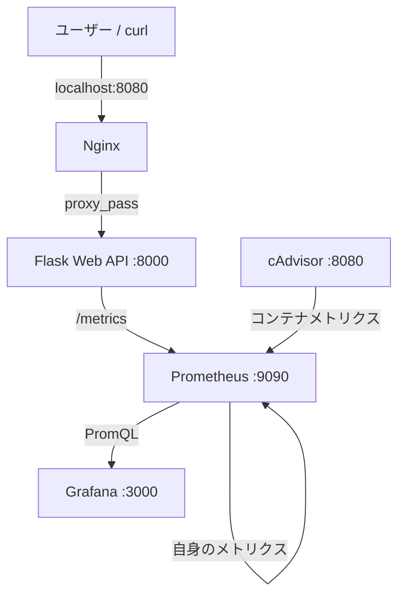

# Docker + Prometheus + Grafana Web Service Monitoring

Docker Composeで起動できる、Flask製Web APIの監視基盤です。Nginxを入口に置き、PrometheusでアプリケーションとDockerコンテナのメトリクスを収集し、Grafanaで時系列グラフとして可視化します。

## 1. プロジェクト概要

このプロジェクトでは、次の流れを実際に動かします。

1. ユーザーがNginxへHTTPリクエストを送る
2. NginxがFlask APIへリバースプロキシする
3. Flaskがレスポンスを返し、リクエスト数・ステータス・処理時間をメトリクスとして公開する
4. PrometheusがFlask、cAdvisor、自身を定期的にスクレイプする
5. GrafanaがPrometheusのデータを読み取り、ダッシュボードへ表示する

## 2. 制作背景

インフラエンジニアに興味があり、Webサービスが実際にどのように監視されているのかを理解するために制作しました。Docker、Prometheus、Grafanaを組み合わせ、サービスを構築するだけではなく、稼働状況やアクセス状況を可視化するところまで経験することを目的としています。

## 3. システム構成図



### データの流れ

ユーザー向けのAPIアクセスはNginx経由です。一方、PrometheusのスクレイプはComposeネットワーク内で`app:8000/metrics`と`cadvisor:8080/metrics`へ直接行います。GrafanaはブラウザからPrometheusへ直接アクセスするのではなく、GrafanaコンテナがPrometheusをデータソースとして読み取ります。

## 4. 使用技術

| 技術 | このプロジェクトでの役割 |
| --- | --- |
| Docker | Flask、Nginx、Prometheus、Grafana、cAdvisorを分離して実行 |
| Docker Compose | 5つのコンテナ、ネットワーク、永続ボリュームを一括管理 |
| Python / Flask | `/`、`/health`、`/slow`、`/error`、`/metrics`を持つ監視対象API |
| prometheus_client | FlaskのCounterとHistogramをPrometheus形式で公開 |
| Prometheus | 各ターゲットを5秒間隔でスクレイプし、時系列データとして保存 |
| Grafana | Prometheusのデータソースを使った6パネルのダッシュボード |
| cAdvisor | DockerコンテナのCPU使用率・メモリ使用量などを収集 |
| Nginx | 外部公開の入口とFlaskへのリバースプロキシ |

## 5. 起動方法

### 前提

- Docker Desktopが起動していること
- Docker Compose v2が使えること
- macOSではDocker DesktopのLinuxコンテナが動いていること

### 起動

初回だけGrafanaの認証情報ファイルを作成します。`.env`はGit管理対象外です。

```sh
cp .env.example .env
docker compose up -d --build
```

停止する場合は次のコマンドです。

```sh
docker compose down
```

コンテナを停止してもPrometheusとGrafanaの名前付きボリュームは残るため、ダッシュボード設定や時系列データを再利用できます。初期状態からやり直す場合は、内容を確認したうえで`docker compose down -v`を実行してください。

## 6. アクセス先

| 対象 | URL | 用途 |
| --- | --- | --- |
| Web API（Nginx経由） | http://localhost:8080/ | 通常アクセス |
| ヘルスチェック | http://localhost:8080/health | HTTP 200の確認 |
| 低速API | http://localhost:8080/slow | レスポンスタイムの確認 |
| エラーAPI | http://localhost:8080/error | HTTP 500の確認 |
| Prometheus | http://localhost:9090 | TargetsとPromQLの確認 |
| Grafana | http://localhost:3000 | ダッシュボードの確認 |
| cAdvisor | http://localhost:8081 | コンテナメトリクスの確認 |

Grafanaのログイン情報は、`.env`に設定した`GRAFANA_ADMIN_USER`と`GRAFANA_ADMIN_PASSWORD`です。

## 7. 監視している項目

### Flaskアプリケーション

- `http_requests_total{method, endpoint, status}`: HTTPリクエストの累積数。`status="500"`を絞るとエラー数として確認できます。
- `http_request_duration_seconds_bucket`: Histogramのバケット。`histogram_quantile`を使うことで、エンドポイントごとのp95レスポンスタイムを計算できます。
- `http_request_duration_seconds_count` / `_sum`: リクエスト数と処理時間の合計。平均処理時間を確認したい場合にも利用できます。

ラベルの`endpoint`には生のURLではなくFlaskのルート（例：`/slow`）を入れています。クエリパラメータなどをそのままラベルにすると時系列の種類が増え続けるため、低カーディナリティを意識しています。

### Dockerコンテナ

cAdvisorを通じて次のメトリクスを取得します。

- `container_cpu_usage_seconds_total`: コンテナが使用したCPU時間の累積値。`rate`でCPU使用率へ変換します。
- `container_memory_working_set_bytes`: コンテナのメモリ使用量。
- コンテナ名などのラベル: どのコンテナの値かを区別するために使用します。

ホストOS全体ではなく、Composeで起動したコンテナを中心に見られるようにしています。

### PrometheusのTargets

Prometheusの`Status > Targets`では、`flask-app`、`cadvisor`、`prometheus`の3つが`UP`になります。`UP`は、Prometheusが対象の`/metrics`エンドポイントから正常にデータを取得できたことを意味します。

## 8. Grafanaダッシュボード

`grafana/dashboards/web-service-monitoring.json`をProvisioningしているため、初回起動時から「Web Service Monitoring」ダッシュボードを利用できます。データソースも`grafana/provisioning/datasources/prometheus.yml`で自動登録されます。

| パネル | 確認できること |
| --- | --- |
| HTTP requests per minute | 一定時間あたりのアクセス量。通常アクセスを増やすと上昇 |
| Requests by HTTP status | 200、500などのステータス別のリクエスト量 |
| API response time (p95) | エンドポイントごとの95パーセンタイル処理時間。`/slow`で上昇 |
| HTTP 500 errors per minute | 500エラーの発生量。`/error`で上昇 |
| Container CPU usage | cAdvisorが収集したコンテナCPU使用率 |
| Container memory usage | cAdvisorが収集したコンテナメモリ使用量 |

スクリーンショットを追加する場合は、`docs/images/grafana-dashboard.png`に配置してください。


## 9. 動作確認方法

### 個別に確認

```sh
curl http://localhost:8080/
curl http://localhost:8080/health
time curl http://localhost:8080/slow
curl -i http://localhost:8080/error
curl http://localhost:8080/metrics
```

`/slow`は約2秒待ってから200を返し、`/error`は意図的に500を返します。アクセス後、Grafanaの時間範囲を`Last 15 minutes`などにして、5秒程度待つとPrometheusの収集結果が反映されます。

### まとめてトラフィックを発生

```sh
chmod +x scripts/generate_traffic.sh
./scripts/generate_traffic.sh
```

デフォルトでは各エンドポイントへ5回アクセスします。回数やURLは環境変数で変更できます。

```sh
REQUESTS=20 BASE_URL=http://localhost:8080 ./scripts/generate_traffic.sh
```

確認ポイントは次のとおりです。

- `/`のアクセス回数を増やすと、リクエスト数パネルが増える
- `/slow`を実行すると、`/slow`のp95レスポンスタイムが高くなる
- `/error`を実行すると、500の系列とHTTP 500エラーパネルが増える

## ディレクトリ構成

```text
.
├── compose.yaml
├── .env.example
├── README.md
├── app/
│   ├── Dockerfile
│   ├── app.py
│   └── requirements.txt
├── nginx/nginx.conf
├── prometheus/prometheus.yml
├── grafana/
│   ├── dashboards/web-service-monitoring.json
│   └── provisioning/
│       ├── dashboards/default.yml
│       └── datasources/prometheus.yml
├── scripts/generate_traffic.sh
└── docs/images/
```
